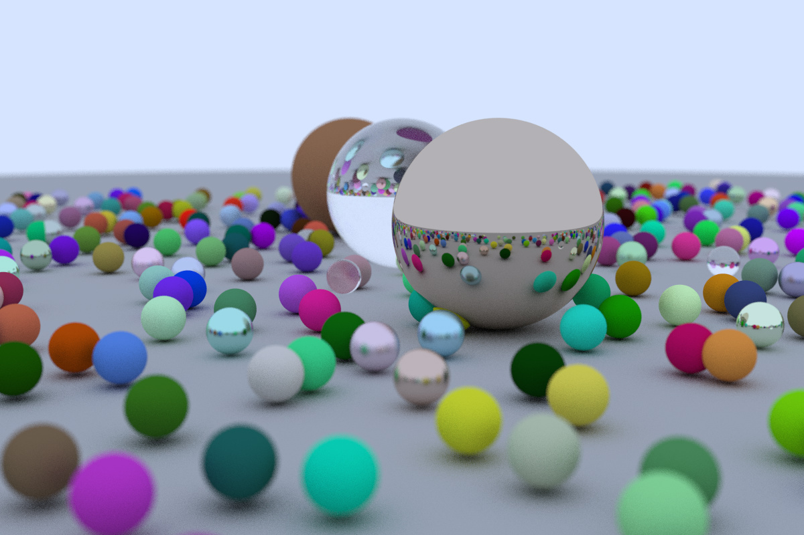
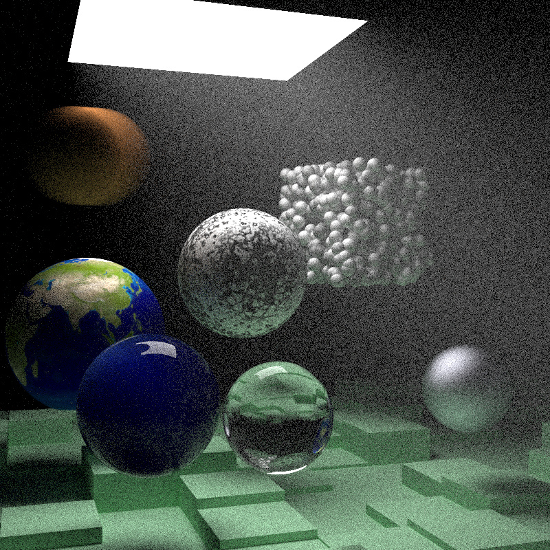
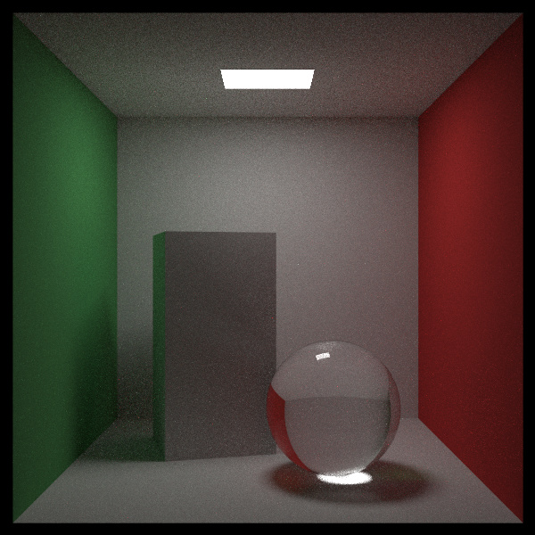

# RayTracingManyWeeksWithCuda

## Introduction

This work is based on the legendary book [Ray Tracing in One Weekend](https://raytracing.github.io) by Peter Shirley. The original code is written in C++ and I have ported it to CUDA. The code is also heavily inspired by Roger Allen's [CUDA implementation](https://github.com/rogerallen/raytracinginoneweekendincuda). The sole purpose of this project is to learn CUDA and ray tracing and I try to document my learnings in this README as well as my github [blog](https://xiahongze.github.io/).

## Build

### Prerequisites

- CUDA 12.0
- Ubuntu 20.04
- make

### Build

```bash
make

# or
make DEBUG=true
```

### Run

```bash
$ ./main --help
A simple ray tracer
Usage:
  Ray Tracer [OPTION...]

  -o, --output arg            Output file (JPEG) (default: out.jpg)
  -w, --width arg             Image width (default: 1200)
  -h, --height arg            Image height (default: 800)
  -s, --samples arg           Samples per pixel (default: 10)
      --tx arg                Threads in x direction (default: 6)
      --ty arg                Threads in y direction (default: 4)
  -c, --choice arg            choice of scenes:
                              0. random spheres
                              1. globe
                              2. two perlin spheres
                              3. quads
                              4. simple light
                              5. cornell box
                              6. final scene week2
                               (default: 0)
      --seed arg              Random seed (default: 1984)
      --max-depth arg         max number of bounce (default: 50)
      --wk1-bounce            Enable bouncing spheres
      --wk1-bounce-pct arg    Percentage of bouncing spheres (default:
                              0.33)
      --wk1-checker           Use checker board ground
      --wk2-rotate-translate  Whether to rotate and translate the boxes
      --wk2-smoke             Add smoke to cornell box
      --help                  Print help
```

## Examples

### Random spheres

```bash
./main -c 0 -s 100 -o random-spheres.jpg
```



### Week 2 final scene

```bash
./main -c 6 -s 200 --seed 42 --tx 8 --ty 8 --width 800 --height 800 -o wk2-final-scene.jpg
```



### Week 3 final scene

```bash
./main -s 500 -c 7 -h 600 -w 600 --tx 6 --ty 8 -o wk3-final-scene.jpg
```



## Some learnings

### Why keeping `hittable **list` instead of `hittable *list`?

The reason behind this is actually complicated. Jump into the posts below for detailed explanations.

- [How to implement device side CUDA virtual functions?](https://stackoverflow.com/questions/26812913/how-to-implement-device-side-cuda-virtual-functions)
- [Polymorphism and derived classes in CUDA / CUDA Thrust](https://stackoverflow.com/questions/22988244/polymorphism-and-derived-classes-in-cuda-cuda-thrust/23476510#23476510)

My simple layman explanation is that,

- `hittable` is an abstract class containing a virtual function `hit`.
- `hittable_list` is a derived class of `hittable` containing a list of `hittable` objects.
- To use virtual functions in CUDA, we need to have the object instantiated in device memory.
- We can't just use cudaMalloc directly on host to allocate memory directly for the class and instead, we need to
  - cudaMalloc to allocate memory of a pointer to the class on host
  - pass this pointer to a kernel
  - use `new` to allocate memory for the class in device (that is how a class is instantiated in device memory)
  - or `malloc` directly in device memory in a kernel

The reason for using `hittable` is that we want to keep this simple interface such that objects of different types can be stored in the same list.

### Bounding Volume Hierarchy (BVH)

Bounding Volume Hierarchy (BVH) is a tree structure commonly used in computer graphics, particularly in the fields of collision detection and ray tracing. This data structure allows for efficient representation and querying of a spatial scene by encapsulating geometry (such as triangles in a mesh) within bounding volumes, typically boxes or spheres. These volumes are organized hierarchically, with each node in the tree containing a volume that encompasses its children, leading to a fast exclusion of large parts of the scene when testing for intersections.

The linearization of BVH for GPU computation is a crucial optimization technique. GPUs, being massively parallel processors, prefer data structures with regular, predictable access patterns. Linearizing a BVH involves flattening the tree structure into a linear array that can be efficiently traversed by the GPU. This transformation typically involves ordering the nodes of the tree in a way that reduces memory jumps during traversal, which is critical for maintaining high performance in GPU-based computations. This linearization enables faster traversal speeds, making it highly suitable for real-time applications like gaming and interactive simulations, where rapid rendering is essential.

Here in this project, an array of `bvh_data_node` containing object information is passed from GPU to CPU and in CPU, we construct a tree of `_bvh_node`. After that, we linearize the tree into an array of `bvh_node` and pass it back to GPU. In GPU, we limit the stack size for non-recursive traversal. Adjust `MAX_TREE_HEIGHT` `in`bvh.h` to change the stack size if needed.

### Dynamical memory allocation in CUDA

In CUDA device functions, we can use `malloc` or `new` to allocate memory dynamically. However, it is advised that we use them with caution because it might cause unexpected race conditions. If you need to do so, do it with one thread for max safety. To avoid these issues, it's generally recommended to pre-allocate memory where possible, and to use shared memory for inter-thread communication within blocks. This approach minimizes the need for dynamic memory allocation and reduces the risk of race conditions.

### Virtual functions & Memory allocation in CUDA

Subclasses need to be created dynamically in device function. If allocated using `cudaMalloc` in host, the pointer is not aligned and later
it causes issues when accessing members of the class. To avoid this, we need to use `new` to allocate memory for the class in device.

If this is a problem, consider avoiding using an abstract class at all.

### Virtual functions & debugging issues

If you are compiling with `-G` flag, you might encounter the following error when using virtual functions.

```
CUDA error = 719 at main.cu:75 'cudaDeviceSynchronize()'
```

This gives none information about the error as the problem apparently works fine without `-G` flag. To debug this, you need `-dopt=on` to optimize the code as well as `-G` to insert debug symbols. This is not ideal as removing optimization generally makes code more debuggable. However, in this case, it does the opposite.

### Random number generation in CUDA

It is very important to initialize the random number generator with different seeds for each thread and even when you only have one thread. Otherwise, all threads will generate the same random numbers. This is because the random number generator is deterministic and it will generate the same sequence of numbers for the same seed.
